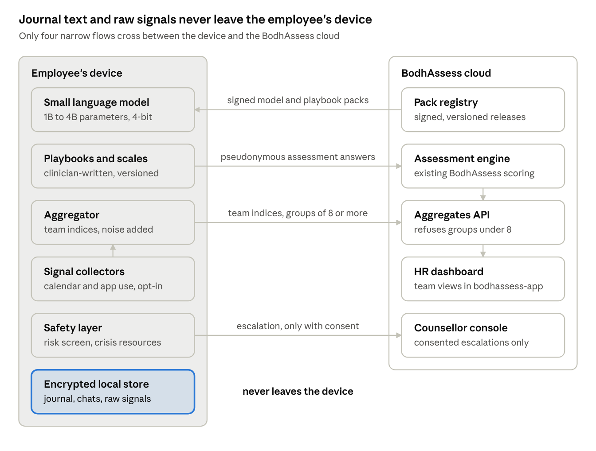
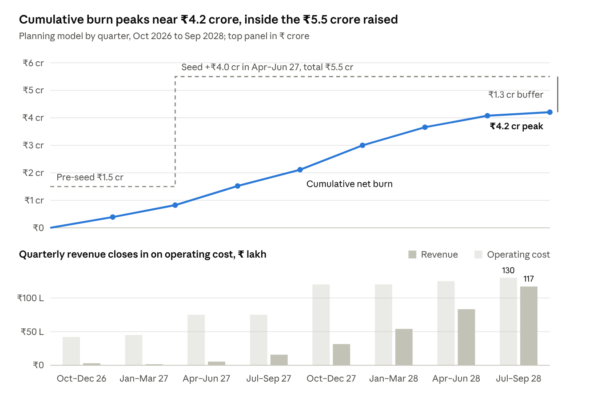
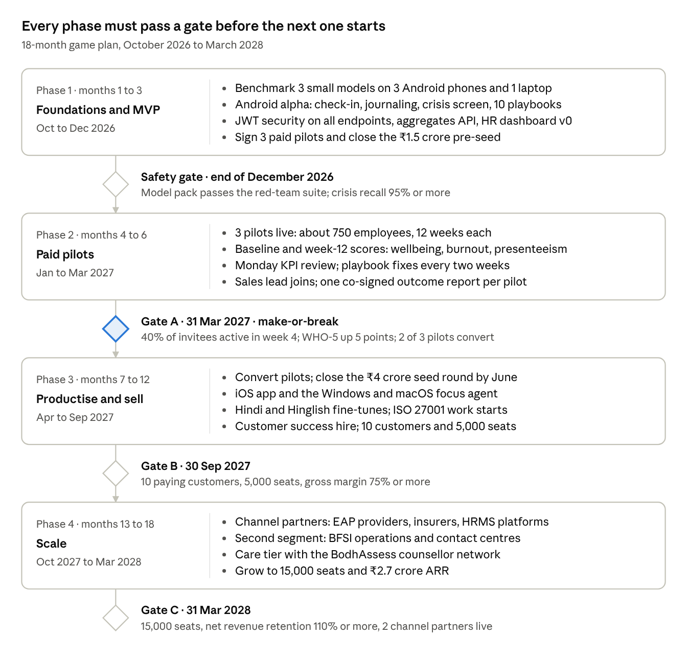

# BodhAssess Edge — Business Plan & Game Plan

Oct 5, 2026 · Utkrisht Mittal

> Exported from the live doc: https://claude.ai/code/artifact/e8071429-9005-422c-8528-a4aa9c6267ac. The live doc is the version to edit; this copy is a snapshot.

## Executive summary

BodhAssess Edge is a private wellbeing and productivity companion for employees. A small language model runs on each employee's own phone or laptop, and only anonymous team-level indices leave the device. It turns BodhAssess's validated psychometric assessments into a 60-second daily habit: check-ins, guided journaling and focus insights. With the employee's consent, it routes people at risk to a human counsellor.

The design principle that makes it sellable: **productivity is measured for the employee, not about them.** Managers never see an individual score.

- **Who pays:** HR and wellbeing leaders at Indian companies with 200 to 5,000 employees, starting with IT services, global capability centres (GCCs) and BFSI operations.
- **What they get:** a monthly team wellbeing and burnout-risk index, an estimate of productivity lost to poor health, and counselling support that employees actually use.
- **Why we win:** the AI runs on the device. That means no employee surveillance, no per-chat cloud cost, and a simpler DPDP Act story than any cloud chatbot.
- **Revenue model:** ₹150 per employee per month (PEPM) blended across three tiers priced ₹60 to ₹250. Software gross margin target is 80% or more.
- **18-month targets:** 3 paid pilots by March 2027; 10 paying customers and 5,000 seats by September 2027; 15,000 seats (₹2.7 crore ARR) by March 2028.
- **The ask:** about ₹1.5 crore now to reach pilot results, then a ₹4 crore seed round between April and June 2027, after the pilot results. Cumulative net burn peaks near ₹4.2 crore. Monthly break-even comes around month 24, at 30,000 seats.

Every price, conversion rate and seat count here is a planning assumption. The pilots exist to prove or kill them.

## Problem and opportunity

Poor mental health already costs Indian employers about US$14 billion a year, and the biggest share is lost productivity at work, not days off. That is the gap this product measures and works to close.

- **Global:** WHO estimates that 12 billion working days are lost each year to depression and anxiety, costing US$1 trillion in lost productivity ([WHO fact sheet, September 2026](https://www.who.int/news-room/fact-sheets/detail/mental-health-at-work)).
- **India:** Deloitte's 2022 survey of 3,995 employees put the cost at about ₹1.1 lakh crore (US$14 billion) a year. That breaks down into presenteeism US$6.6 billion, turnover US$5.9 billion and absenteeism US$1.9 billion. More than 80% of respondents reported at least one adverse mental health symptom ([Deloitte India, September 2022](https://www.deloitte.com/content/dam/assets-shared/legacy/docs/perspectives/2022/gx-mental-health-2022-report-noexp.pdf)). The survey ran during COVID-19, so treat it as an upper reference point.

**Why today's tools don't fix it:**

1. Annual engagement surveys report months late and cannot help any one person.
2. Employers pay for counselling (EAP) that few employees use, out of stigma or fear that the employer will find out. Discovery interviews must confirm usage rates.
3. Productivity monitoring tools add stress and erode trust, the opposite of what wellbeing needs.
4. Cloud AI chatbots ask employees to trust both a vendor and their employer with their most private words.

**The opportunity:** a product that measures the productivity cost of poor wellbeing without watching anyone, and that employees trust enough to use every day.

**Market size, bottom-up.** Published estimates of India's corporate wellness market for 2025 range from US$0.68 billion ([Ken Research](https://www.kenresearch.com/india-corporate-wellness-market)) to US$2.6 billion ([IMARC](https://www.imarcgroup.com/india-corporate-wellness-market)), a fourfold spread, so this plan does not rely on them. India's tech industry alone employs about 5.95 million people (NASSCOM estimate for FY26, [reported by DQIndia](https://www.dqindia.com/news/nasscom-outlook-indias-tech-industry-to-grow-61-to-315-bn-in-fy26-11151228)). At ₹1,800 per seat per year, that one segment is worth about ₹1,070 crore a year. Each 1% of it is about 60,000 seats and ₹10.7 crore of ARR. The 18-month target of 15,000 seats is 0.25% of that one segment.

## Solution: what the on-device AI does

The product is five capabilities on one app, and each one has a clear rule for what leaves the device. The language model is the interface, not the instrument: it asks questions in natural language and coaches, but every score comes from a validated BodhAssess item, so the numbers stay defensible.

| Capability | What the employee gets | What leaves the device |
| --- | --- | --- |
| Daily check-in (60 seconds) | A conversational check on mood, energy, stress, sleep and focus. The model maps each answer to a fixed scale item from the BodhAssess question bank. | Nothing individual. It feeds the weekly team aggregate. |
| Journaling and coaching | CBT-informed prompts, reframing, breathing and day-planning exercises. Clinicians write the playbooks; the model adapts the wording. | Nothing. Journal text never syncs. |
| Focus and workload insights (opt-in, laptop) | A weekly personal summary of meeting load, focus blocks, context switching and after-hours work, plus nudges to protect focus time. | Team medians only, and only for groups of 8 or more. |
| Validated assessments (monthly or quarterly) | Wellbeing, burnout and presenteeism scales run through the existing BodhAssess assessment engine, with a personal results page. | Pseudonymous answers, for scoring. The employer sees aggregates only. |
| Risk triage and escalation | On-device risk screening shows crisis resources instantly, even offline, and offers a counsellor session. | An escalation request, and only when the employee says yes. |

**How productivity is measured.** Two honest signals, neither of them surveillance. First, validated self-report of presenteeism and absenteeism, which converts into rupees of productivity lost. Second, work-pattern signals from calendar and app-category metadata, shown only to the employee. There are no keystrokes, screenshots or message content.

**What each audience sees:**

- **Employee:** their own trends, coaching and results. They can wipe everything on the device in one tap.
- **HR buyer:** a monthly team wellbeing index, burnout-risk distribution, participation rate, a presenteeism cost estimate, and trends before and after company actions.
- **Counsellor (BodhAssess practitioner):** a queue of consented escalation requests and, with consent, that client's assessment results.

**What BodhAssess already has:** the question bank with risk-flagged items, the measured-quality taxonomy that scores answers, assessments with per-attempt tracking, organisation membership, practitioner and respondent accounts, and the respondent portal. Edge adds the device app, the model, and the privacy-preserving aggregation layer on top.

## Why edge: the moat argument

On-device AI matters because trust drives participation, and participation is the whole business. An index built from 10% of employees is worthless. People will not journal honestly into a chatbot their employer pays for unless they can see the data never leaves their phone. Edge makes "your employer cannot read this" true by architecture, not just by policy.

| Dimension | Edge (on device) | Cloud chatbot |
| --- | --- | --- |
| Privacy promise | Provable: raw text never leaves the device | A policy the employee has to trust |
| DPDP Act exposure | We process far less personal data, so consent and breach scope stay small | Every conversation is personal data we hold |
| Cost per conversation | About zero; it runs on hardware the user already owns | Grows with every message |
| Latency and offline | Instant; works on a train with no signal | Needs a network |
| Model quality | Smaller models: weaker at open conversation, fine for structured flows | Strongest models available |
| Safety monitoring | No server logs, so safety must be built and tested before release | Can be monitored centrally |

The moat is not the model, which anyone can download. It is the combination around it:

1. Validated instruments and a scoring engine (BodhAssess already has these).
2. Clinically reviewed coaching playbooks that keep a small model on rails.
3. Small models fine-tuned for English, Hindi and Hinglish wellbeing conversations.
4. A privacy-preserving aggregation pipeline that HR, IT and legal teams sign off quickly.

**The honest trade-offs.** Small models are less fluent. Low-end Android phones lack the memory. Model updates have to be shipped to devices. The plan handles these with structured flows instead of open-ended therapy chat, a "lite mode" without a generative model for low-end phones, and signed model packs that must pass a safety test suite before release.

## Customers and market

Start with IT services and GCCs. Their staff work on company laptops, where the focus-insights agent runs best. Burnout is a known problem there, and HR teams already hold wellbeing budgets.

**Ideal first customer:** 500 to 5,000 employees, at least 60% knowledge workers on company laptops, an existing EAP with low usage, and burnout or attrition flagged in the last engagement survey.

| Priority | Segment | Why they buy | Typical size | Device |
| --- | --- | --- | --- | --- |
| 1 | IT services and GCCs (Bengaluru, Hyderabad, Pune, Chennai, NCR) | Burnout, attrition, global parent companies that demand privacy | 500 to 5,000 seats | Laptop and phone |
| 2 | BFSI operations, BPO and contact centres | Shift work, high attrition, productivity they can measure | 300 to 3,000 seats | Android phone |
| 3 | Growth-stage startups | Founders who worry about burnout and decide fast | 200 to 1,000 seats | Laptop and phone |
| 4 | Hospitals (nurses, resident doctors) | Severe burnout; fits the BodhAssess clinical vertical | 200 to 2,000 seats | Android phone |
| Later | Colleges and coaching institutes | Large need, but under-18 users need verifiable parental consent under DPDP | Varies | Phone |

**Who is in the deal:**

- **Economic buyer:** CHRO or Head of Total Rewards.
- **Champion:** the wellbeing lead or a senior HR business partner.
- **Gatekeepers:** the CISO or IT (installing on devices) and Legal (DPDP compliance). Bring the privacy architecture to the first meeting.
- **User:** the employee. If they don't open the app, the buyer does not renew.
- **Supply side:** counsellors and psychologists already on BodhAssess, who take escalations in the Care tier.

The Problem section sizes the market from the bottom up.

## Business model and pricing

Annual per-seat SaaS in three tiers, landing with a paid pilot. The plan assumes a blended ₹150 per employee per month (₹1,800 a year).

| Tier | What's included | Price (₹ PEPM) | Gross margin target |
| --- | --- | --- | --- |
| Insight | Quarterly validated assessments, team dashboard, presenteeism cost estimate | 60 | 85% |
| Companion | Insight plus the edge AI app: check-ins, coaching, focus insights, monthly index | 150 | 80% to 85% |
| Care | Companion plus a pool of counselling sessions and an escalation response-time commitment | 250 | About 50% on the add-on |
| Pilot | 90 days, up to 250 employees, success criteria agreed upfront; credited to the annual contract | ₹1.5 lakh flat | Not a profit line |

**Unit economics per Companion seat, per year (estimates):**

- Revenue: ₹1,800.
- Cloud (sync, aggregates, dashboards): about ₹60. No inference cost, because the model runs on the device.
- Customer success and support: about ₹150.
- Clinical content review, spread across seats: about ₹100.
- Gross margin: about 83%.

**Contract assumptions:** about 500 seats per customer in year one (₹9 lakh ACV), rising past 1,000 as customers expand. Sales cycles run 3 to 6 months. The target is CAC payback under 12 months.

**Other revenue, not in the base plan:** Care-tier counselling margin, and assessment consulting through the existing BODH practice. Both are upside.

## Go-to-market

The first 10 customers come from founder-led sales into existing BODH consulting relationships, converted through paid pilots. Channels come after there is a published outcome report to hand them.

1. **Target list (month 1).** 40 accounts that match the ideal customer, warmest first. Start with HR leaders who already buy BODH psychometric consulting.
2. **Paid 90-day pilots (months 2 to 6).** Agree three things upfront: the success metrics, the participation target and the conversion price. A free pilot gets no attention; ₹1.5 lakh does.
3. **Outcome report (month 6).** A pre/post report co-signed with each pilot client covering wellbeing, burnout, participation and presenteeism cost. This becomes the main sales asset.
4. **Channels (from month 9):**
    - EAP providers and counselling networks with no digital layer, as a white-label offer.
    - Group health insurers and brokers, bundled into wellness programmes.
    - HRMS platforms such as Darwinbox, Keka and greytHR, for single sign-on and employee roster sync.
    - HR community events: SHRM India and NHRD chapters.
5. **Land and expand.** Land on Insight or a pilot, move to Companion, then add Care once the escalation volume justifies it.

**The employee launch kit (this decides participation):**

- A note from the CEO stating what the company can and cannot see.
- A one-page "your data" sheet in English and Hindi.
- A 20-minute manager briefing: why managers will never see individual data, and how to talk about it.
- A 21-day check-in challenge to build the habit.

## Product and technology architecture

The device does the thinking and the cloud does the counting. Everything personal stays in an encrypted store on the phone or laptop. The existing spring-social backend receives only scored answers, team aggregates and consented escalations.

Signal collectors feed the on-device aggregator, which adds statistical noise and uploads team indices only. In the cloud, assessment scores and team indices both feed the HR dashboard.

**Model choice by device.** Mid-range Android phones are the main target, because Google's built-in Gemini Nano runs mostly on flagships ([supported devices](https://developers.google.com/ml-kit/genai)). So the app ships its own small open model there.

| Device class | Model on the device | Runtime | Role in the plan |
| --- | --- | --- | --- |
| Android, 6 to 8 GB RAM | An open model of about 1B parameters, 4-bit, under 1 GB: [Qwen3-0.6B](https://huggingface.co/Qwen/Qwen3-0.6B) or a small [Gemma 4](https://blog.google/innovation-and-ai/technology/developers-tools/gemma-4/) variant, both Apache 2.0 | llama.cpp, MLC LLM or LiteRT | Main pilot target |
| Android flagships | Google's [Gemini Nano](https://developer.android.com/ai/gemini-nano) via ML Kit GenAI | Android AICore | Optional upgrade |
| iPhone and Mac with Apple Intelligence | Apple's built-in on-device model, about 3B parameters, via the [Foundation Models framework](https://www.apple.com/newsroom/2025/09/apples-foundation-models-framework-unlocks-new-intelligent-app-experiences/) | Native, OS version 26 and later | iOS launch in Phase 3 |
| Laptops with 16 GB RAM | A 3B to 4B model, 4-bit, such as [Phi-4-mini](https://huggingface.co/microsoft/Phi-4-mini-instruct) (3.8B, MIT licence) | llama.cpp or ONNX Runtime | Also runs focus insights |
| Phones under 4 GB RAM | No generative model ("lite mode") | Scripted flows | Same scores, simpler conversation |

Prefer Apache 2.0 or MIT models. Gemma 3 uses Google's own terms with a prohibited-use policy, which a customer's legal team will query.

**Backend work in spring-social** (each schema change ships as a Flyway migration):

1. JWT security on every endpoint. The new endpoints have none today, and this blocks any pilot.
2. Consent records and an audit log.
3. Pseudonymous respondent IDs for answers submitted from the device, reusing Assessment and RespondentAssessmentMapping.
4. An aggregates API that refuses any group smaller than 8.
5. A signed pack registry for models and playbooks.
6. A counsellor escalation queue for practitioner accounts.

## Ethics, privacy and regulation

A product that measures productivity can easily make mental health worse. These lines are written into the product, the contract and the sales pitch, so no customer can buy their way around them.

**Things the product will never do:**

- Log keystrokes, take screenshots, or read messages, emails or documents.
- Infer emotion from face, voice or other biometric data. Every mood signal is self-reported.
- Show a manager or HR any individual's score, check-in or journal.
- Allow outputs in performance reviews, promotions or exits. This is a contract clause, and breaking it ends the contract.

| Control | How it works |
| --- | --- |
| Minimum group size | No team view below 8 people. Small cells are suppressed and statistical noise is added before upload. |
| Consent | Separate, revocable consent for each signal (calendar, app activity, assessments, escalation), written in plain English and Hindi. |
| Data on device | Encrypted local store, a one-tap wipe, and no cloud backup of journal text. |
| Pseudonymous IDs | Assessment answers sync under a pseudonym. Identity is linked only when the employee asks for a counsellor. |
| Clinical boundary | Positioned as wellness, not diagnosis or treatment. No claims like "treats depression". |
| Clinical governance | Licensed clinical psychologists write and review every playbook. A clinical advisory board meets quarterly. |
| Crisis path | On-device detection shows crisis helplines (including India's national Tele-MANAS line, 14416) and emergency numbers instantly, even offline, then offers a counsellor. |
| Model safety gate | Every model pack must pass a red-team test set before release, with a crisis-detection recall target of 95% or more. |
| Security certification | ISO 27001 work starts in month 7. Enterprise buyers will ask for it. |

**Regulation to track:**

- **India's DPDP Act.** The Rules were notified in November 2025. The core duties apply from about 13 May 2027: notice, security safeguards, breach reporting to the Data Protection Board within 72 hours, and verifiable parental consent for children ([DPDP Rules](https://www.meity.gov.in/static/uploads/2025/11/53450e6e5dc0bfa85ebd78686cadad39.pdf), [PIB summary](https://static.pib.gov.in/WriteReadData/specificdocs/documents/2025/nov/doc20251117695301.pdf)). The pilots run before that date, but the product meets those duties from day one. Penalties reach ₹250 crore for security failures.
- **Medical-device rules.** These would apply to software only if we make clinical claims, so we don't.
- **EU AI Act, Article 5(1)(f).** Since 2 February 2025 it has banned AI that infers emotions in the workplace ([Article 5](https://artificialintelligenceact.eu/article/5/)). Commission guidance limits the ban to biometric data, so self-reported text falls outside it ([FPF analysis](https://fpf.org/blog/red-lines-under-eu-ai-act-unpacking-the-prohibition-of-emotion-recognition-in-the-workplace-and-education-institutions/)). It matters only if we expand to the EU, and the design already avoids it.

## Competition and differentiation

None of the main Indian players markets on-device or offline AI. At least one sells the exact opposite: predictive risk detection on individual employees. That leaves the privacy-first position open. Microsoft Viva Insights is the closest in philosophy, but it covers productivity patterns only, inside Microsoft 365, with no clinical layer.

| Player | What they sell to employers | Where BodhAssess Edge differs |
| --- | --- | --- |
| [Wysa](https://www.wysa.com/for-employers) | A 24/7 anonymous AI chatbot, a benefits hub that routes to EAP, coaches or crisis lines, and analytics for employers | Our AI runs on the device; scores come from validated instruments, not chat |
| [Amaha](https://www.amahahealth.com/services/employee-wellness-programme/main/) (formerly InnerHour) | Surveys and bot check-ins, therapy, psychiatry, self-care, a 24/7 helpline and workshops | Productivity measurement, and a lighter-weight daily habit |
| [MindPeers](https://www.mindpeers.co/eap) | An AI-powered EAP: 24/7 therapy in 15+ languages, chat bots in WhatsApp, Slack and Outlook, an HR dashboard with predictive risk detection | We refuse individual risk scores for employers; that refusal is the pitch |
| [YourDOST](https://in.linkedin.com/company/d-o-s-t) | Counselling and employee wellness programmes | A self-serve AI layer, with counsellors on escalation only |
| [Microsoft Viva Insights](https://learn.microsoft.com/en-us/viva/insights/advanced/setup-maint/privacy-settings) | Personal focus and wellbeing insights only the employee sees; de-identified manager views with a minimum group size of 5 | Mental health support and validated scales, any device, a stricter minimum group of 8 |
| Traditional EAPs and annual surveys | Counselling hotlines; once-a-year engagement scores | Weekly signal and daily use, instead of yearly data and low uptake |

**Where we win:** a CHRO who wants a burnout signal their employees will trust, without buying a monitoring tool. **Where we lose:** buyers who want individual risk flags, or who already standardised on one global EAP vendor.

## Financial plan

The business needs about ₹5.5 crore in two rounds: ₹1.5 crore now and ₹4 crore from April to June 2027, after the pilot results. Cumulative net burn peaks near ₹4.2 crore in mid-2028, which leaves about ₹1.3 crore of buffer when monthly revenue catches up with cost.

The pre-seed lasts until about June 2027, so the seed round has to close by then. If it slips, Phase 3 hiring waits.

| Assumption | Value |
| --- | --- |
| Blended price | ₹150 per employee per month, recognised monthly |
| Seats live | 2,000 by June 2027, 5,000 by September 2027, 15,000 by March 2028, 30,000 by September 2028 |
| Pilot fees | ₹1.5 lakh each, credited to the annual contract |
| Monthly operating cost | ₹14 to 15 lakh in the pilot phase (about 6 people); ₹25 lakh in Phase 3 (about 12); ₹40 to 43 lakh from Phase 4 (about 18) |
| Not included | Care-tier counselling margin, BODH consulting revenue, and the cash benefit of billing annually upfront |

**Use of funds:** about 65% team, 15% sales and marketing, 10% clinical work and compliance (legal, ISO 27001), and 10% cloud, test devices and buffer.

## Team and hiring plan

The first hire is an on-device ML engineer, because that is the one skill the current BodhAssess team does not have. The team grows from about 6 people in the pilot phase to about 18 by month 18.

| Role | When | Why |
| --- | --- | --- |
| Founder / CEO | Now | Sales to the first 10 customers, fundraising, partnerships |
| Backend and web engineers (Spring Boot, React) | Now (existing) | Assessment engine, aggregates API, HR dashboard, security hardening |
| On-device ML engineer | Month 1 | Model choice, quantisation, fine-tuning, safety evaluation |
| Mobile engineer (Android first) | Month 1 | The companion app and local encrypted store |
| Clinical lead (licensed clinical psychologist) | Month 1, part-time to full-time | Playbooks, instruments, crisis protocol, outcome study design |
| Privacy and legal counsel | Month 1, fractional | DPDP compliance, customer contracts, data processing terms |
| Product designer | Month 2, part-time | The employee experience decides participation |
| Enterprise sales lead | Month 6 | Takes over the pipeline from the founder |
| Customer success | Month 9 | Employee launches, renewals, outcome reports |
| Desktop engineer (Windows and macOS) | Month 7 | The focus-insights agent |

**Advisory board:** two clinicians (a psychiatrist and a clinical psychologist), one privacy expert, and one CHRO from a target segment.

## Risks and mitigations

The biggest risk is low employee participation, because every other number in this plan depends on it. The pilots are designed to test that first.

| Risk | Likelihood | Impact | Mitigation |
| --- | --- | --- | --- |
| Employees see it as surveillance and don't use it | High | High | Privacy by architecture, the contract clause, the CEO note and launch kit; measure trust in the pilot |
| A small model gives harmful advice or misses a crisis | Medium | Severe | Scripted playbooks, an on-device safety classifier, the 95% crisis-recall release gate, clinician review, an incident process |
| HR pushes for individual-level data | High | Medium | A fixed product boundary; treat the request as a sign the customer is a poor fit |
| Outcomes don't move, so customers don't renew | Medium | High | Outcome metrics agreed before each pilot; Gate A decides whether to continue |
| Long enterprise sales cycles | High | Medium | Paid pilots, warm BODH relationships, insurer and EAP channels |
| Low-end phones can't run the model | Medium | Medium | Lite mode without a generative model; lead with laptop-first segments |
| Microsoft, Apple or Google bundle something similar | Medium | Medium | India-specific instruments and languages, a counsellor network and published outcomes |
| Rules change (DPDP Rules, medical-device classification) | Medium | Medium | Fractional counsel, wellness positioning, a quarterly regulatory review |
| Instrument licences: WHO-5 is non-commercial, the Maslach Burnout Inventory is paid, and the HPQ's commercial terms are unconfirmed | Medium | Low | Ask WHO for permission or validate BodhAssess's own scales; use the PHQ screeners, which need no permission |
| Security breach of escalation or assessment data | Low | Severe | JWT security on every endpoint before launch, encryption, ISO 27001, minimal data held centrally |

## Game plan

The next 90 days decide the company. Sign three paid pilots, prove a small model runs safely on the phones employees actually own, and close the security gap in the backend. After that, each phase must pass a gate before the next one starts.

### Days 1 to 30 (by Nov 4, 2026)

- [ ] Interview 15 HR and wellbeing leaders from the target list; test the privacy pitch and the prices.
- [ ] Build the 40-account target list and send pilot proposals to the 10 warmest.
- [ ] Hire the on-device ML engineer and the clinical lead.
- [ ] Benchmark 3 candidate small models on 3 mid-range Android phones and 1 laptop for speed, memory, battery and Hindi quality.
- [ ] Choose the instruments (wellbeing, burnout, presenteeism, risk screen) and confirm their licences. WHO-5 needs WHO's permission for commercial use.
- [ ] Add JWT security to every spring-social endpoint. The new endpoints have none today.
- [ ] Brief privacy counsel on the data processing terms and the no-individual-use clause.
- [ ] Open pre-seed conversations for ₹1.5 crore.

### Days 31 to 60 (by Dec 4, 2026)

- [ ] Sign 2 paid pilots.
- [ ] Ship an internal Android alpha: check-in, journaling, encrypted local store, crisis screen.
- [ ] Clinical lead writes the first 10 coaching playbooks and the crisis protocol.
- [ ] Build the aggregates API with the minimum-group-of-8 rule, and HR dashboard v0 in bodhassess-app.
- [ ] Build the safety test set and run the first red-team pass.
- [ ] Dogfood with the team and 30 friendly users.

### Days 61 to 90 (by Jan 3, 2027)

- [ ] Sign the third pilot.
- [ ] Release the pilot build once it passes the safety gate.
- [ ] Run baseline assessments at every pilot site, then launch with the employee kit.
- [ ] Start the Monday KPI review.
- [ ] Close the ₹1.5 crore pre-seed.

### The 18-month roadmap

Gate A is the make-or-break point. Pilot results fund the seed round, and the seed round funds everything after it.

## KPIs and decision gates

The north-star metric is **weekly reflective employees**: people who complete at least one check-in in a given week. It moves before revenue does, and it is the only number that predicts renewal.

| Gate | Date | Pass criteria | If missed |
| --- | --- | --- | --- |
| A: pilots prove value | Mar 31, 2027 | At least 40% of invited employees active in week 4 and 25% in week 12. Wellbeing (WHO-5) up 5 points or more on its 0 to 100 scale for active users. At least 70% agree "my employer cannot see my data". Crisis recall 95% or more. Zero privacy incidents. At least 2 of 3 pilots convert to paid. | Participation misses: pivot to the assessment-only Insight tier sold through practitioners. Outcomes miss: rework the playbooks and extend one pilot. Conversion misses: re-price. |
| B: repeatable sales | Sep 30, 2027 | 10 paying customers and 5,000 seats. Gross margin 75% or more. No customer churn. CAC payback under 12 months. | Freeze new hiring, cut burn back toward pilot-phase levels, and fix the weakest step in the funnel. |
| C: ready to scale | Mar 31, 2028 | 15,000 seats and ₹2.7 crore ARR. Net revenue retention 110% or more. Two channel partners live. | Stay founder-led in the top segment; hold back on the second segment and on iOS growth spend. |

**Dashboard to review every Monday:** weekly reflective employees, week-4 retention by customer, check-ins per active user, escalations and time to a counsellor, pipeline by stage, seats live, and cash runway in months.

WHO-5 is licensed for non-commercial use only ([WHO-5 terms](https://cdn.who.int/media/docs/default-source/mental-health/who-5_english-original4da539d6ed4b49389e3afe47cda2326a.pdf)). Paid pilots therefore need WHO's permission, or Gate A switches to a BodhAssess wellbeing scale validated against WHO-5. The clinical lead confirms the 5-point threshold before the pilots start.

## Sources

Each page below was opened on 5 October 2026. Prices, seat counts, costs and conversion rates in this plan are planning assumptions, not sourced figures.

- Market and cost of poor mental health: [WHO, Mental health at work](https://www.who.int/news-room/fact-sheets/detail/mental-health-at-work) · [Deloitte India, Mental health and well-being in the workplace (2022)](https://www.deloitte.com/content/dam/assets-shared/legacy/docs/perspectives/2022/gx-mental-health-2022-report-noexp.pdf) · [NASSCOM FY26 outlook, via DQIndia](https://www.dqindia.com/news/nasscom-outlook-indias-tech-industry-to-grow-61-to-315-bn-in-fy26-11151228) · [IMARC, India corporate wellness market](https://www.imarcgroup.com/india-corporate-wellness-market) · [Ken Research, India corporate wellness market](https://www.kenresearch.com/india-corporate-wellness-market)
- Regulation: [DPDP Rules 2025 (MeitY)](https://www.meity.gov.in/static/uploads/2025/11/53450e6e5dc0bfa85ebd78686cadad39.pdf) · [PIB backgrounder on the DPDP Rules](https://static.pib.gov.in/WriteReadData/specificdocs/documents/2025/nov/doc20251117695301.pdf) · [Mondaq, DPDP 2026 compliance milestones](https://www.mondaq.com/india/data-protection/1830402/dpdp-act-and-rules-2025-the-2026-compliance-milestones-businesses-cant-afford-to-miss) · [EU AI Act, Article 5](https://artificialintelligenceact.eu/article/5/) · [EU AI Act, Article 113](https://artificialintelligenceact.eu/article/113/) · [FPF on the workplace emotion-recognition ban](https://fpf.org/blog/red-lines-under-eu-ai-act-unpacking-the-prohibition-of-emotion-recognition-in-the-workplace-and-education-institutions/)
- Crisis line: [PIB on Tele-MANAS](https://www.pib.gov.in/PressReleasePage.aspx?PRID=2022057)
- On-device models: [Apple Foundation Models framework](https://www.apple.com/newsroom/2025/09/apples-foundation-models-framework-unlocks-new-intelligent-app-experiences/) · [Google ML Kit GenAI](https://developers.google.com/ml-kit/genai) · [Gemini Nano on Android](https://developer.android.com/ai/gemini-nano) · [Gemma 4 announcement](https://blog.google/innovation-and-ai/technology/developers-tools/gemma-4/) · [Gemma terms of use](https://ai.google.dev/gemma/terms) · [Qwen3-0.6B](https://huggingface.co/Qwen/Qwen3-0.6B) · [Phi-4-mini-instruct](https://huggingface.co/microsoft/Phi-4-mini-instruct)
- Instruments: [WHO-5 (licence terms)](https://cdn.who.int/media/docs/default-source/mental-health/who-5_english-original4da539d6ed4b49389e3afe47cda2326a.pdf) · [PHQ screeners](https://www.phqscreeners.com/select-screener) · [Maslach Burnout Inventory (Mind Garden)](https://www.mindgarden.com/117-maslach-burnout-inventory-mbi) · [WHO HPQ summary (Shirley Ryan AbilityLab)](https://www.sralab.org/rehabilitation-measures/world-health-organization-health-and-work-performance-questionnaire)
- Competitors: [Wysa for employers](https://www.wysa.com/for-employers) · [Amaha employee wellness](https://www.amahahealth.com/services/employee-wellness-programme/main/) · [MindPeers EAP](https://www.mindpeers.co/eap) · [YourDOST](https://in.linkedin.com/company/d-o-s-t) · [Viva Insights privacy settings](https://learn.microsoft.com/en-us/viva/insights/advanced/setup-maint/privacy-settings) · [Viva Insights personal privacy guide](https://support.microsoft.com/en-us/viva/insights/privacy-guide-for-personal-insights)
