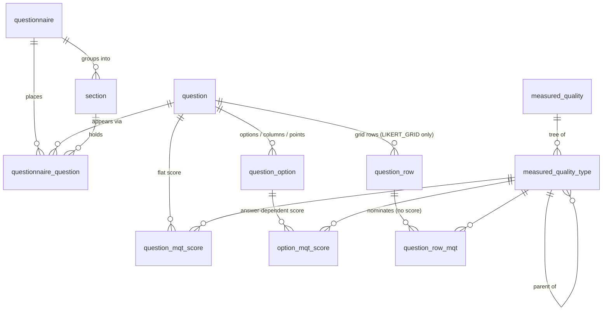
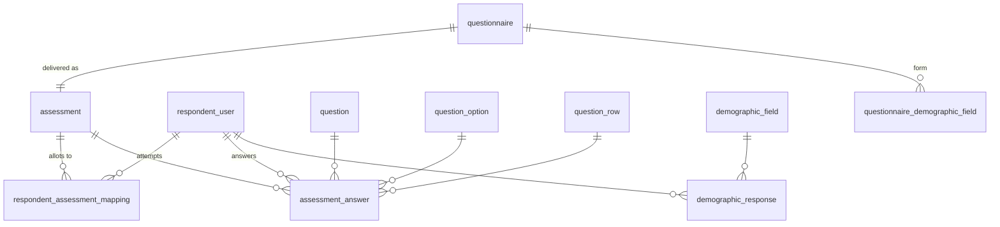

# How questions and answers are stored

**Scope:** `spring-social` only — the current backend. Schema is owned by
Flyway (`src/main/resources/db/migration/V1…V17`) and the entities are checked
against it at boot (`ddl-auto: validate`), so what follows is the real DDL,
not an idealisation.

> `docs/ARCHITECTURE.md` describes the **old** `bodhassess-api-spring`
> backend — `ddl-auto=update`, published-questionnaire snapshots, `app_users`.
> None of that exists here. Read this file instead for anything about
> questions, answers or scoring.

---

## 1. One answer table, always

The single fact worth knowing before any of the detail: **every answered
question writes to `assessment_answer`, whatever its type.** There is no
per-type answer table and no side table for free text. Only the row COUNT
varies:

| question type | rows per answered question | what carries the answer |
| --- | --- | --- |
| MCQ, single choice | 1 | `option_id` |
| MCQ, multi-select | one per selected option | `option_id` |
| `LINEAR_SCALE` | 1 | `option_id` — the generated point |
| `LIKERT_GRID` | one per row | `question_row_id` + `option_id` |
| `SHORT_ANSWER` | 1 | `answer_text`, `option_id` NULL |

Two consequences fall straight out of that, and both are load-bearing:

- **Absence of a row IS "unanswered".** `PortalAssessmentService.submit`
  checks exactly that, per answerable slot, and refuses a submission that
  leaves any placed question — or any row of any grid — without one.
- **Counting rows is not counting answered questions.** A 20-row grid is one
  answered question and twenty rows. That is why the report tally uses
  `count(distinct a.question.questionId)`
  (`AssessmentAnswerRepository.tallyAnswersByAssessment`); counting rows would
  render "answered 20 of 5".

---

## 2. The content model



`question` is a standalone **bank item**. It is not owned by a questionnaire —
`questionnaire_question` is the placement edge, and the same question may be
placed in many questionnaires (once each).

```sql
question(
  question_id, question_type, scale_from, scale_to,
  scale_low_label, scale_high_label, selection_rule, selection_count,
  content_type, stem, media_url, risk_flag, shuffle_options, …)

question_option(option_id, question_id, option_text, content_type, media_url, sort_order)
question_row(question_row_id, question_id, row_text, sort_order)
question_row_mqt(question_row_mqt_id, question_row_id, measured_quality_type_id)
question_mqt_score(question_mqt_score_id, question_id, measured_quality_type_id, score)
option_mqt_score(option_mqt_score_id, option_id, measured_quality_type_id, score)
```

---

## 3. Three independent axes

There is no table per question type because a question varies along three
axes that do not interact:

| axis | column(s) | question it answers |
| --- | --- | --- |
| **shape** | `question_type` | what the author fills in, and what the respondent meets |
| **cardinality** | `selection_rule` + `selection_count` | how many options may be picked |
| **medium** | `content_type` (+ `media_url`) | what the stem/option is made of |

Cardinality is resolved in exactly one place —
`SelectionBounds.of(question)` turns the pair into a floor and a cap — and the
portal is sent the resolved `minSelections`/`maxSelections` so the screen and
the submit validator cannot disagree. `NULL` rule = single choice, which is
what every question meant before the column existed.

`question_type` values: `MCQ` (default), `LINEAR_SCALE`, `LIKERT_GRID`,
`SHORT_ANSWER`, and `PARAGRAPH` — reserved, refused by the API, present only
because widening a MySQL enum rebuilds the table and doing it once is cheaper.

---

## 4. What each type stores

*set* / *NULL* / *empty* per type. This is the fast answer.

| | MCQ | LINEAR_SCALE | LIKERT_GRID | SHORT_ANSWER |
| --- | --- | --- | --- | --- |
| `scale_from` / `scale_to` | NULL | **set** (1—5 default) | NULL | NULL |
| `scale_low_label` / `_high_label` | NULL | optional | NULL | NULL |
| `selection_rule` / `_count` | optional | NULL | NULL | NULL |
| `shuffle_options` | optional | false | false | false |
| `question_option` rows | authored | **generated** points | the shared columns | **none** |
| `question_row` rows | none | none | the items | none |
| `question_row_mqt` rows | none | none | per row | none |
| `question_mqt_score` | flat score | **forced to 0** | flat score | flat score |
| `option_mqt_score` | authored per option | **derived** = the point's own number | authored per column | none |
| `assessment_answer.option_id` | set | set | set | **NULL** |
| `assessment_answer.question_row_id` | NULL | NULL | **set** | NULL |
| `assessment_answer.answer_text` | NULL | NULL | NULL | **set** |

Everything marked *generated*, *derived* or *forced* is written by
`QuestionController` and ignores whatever the caller sent — see §9.

---

## 5. Type by type, with real rows

### 5.1 MCQ

The baseline. Options are authored, each carrying its own MQT scores; a
`selection_rule` makes it multi-select.

```
question(41, MCQ, selection_rule=MAX, selection_count=2)
question_option(150, q=41, "I plan ahead",  sort=0)
question_option(151, q=41, "I improvise",   sort=1)
option_mqt_score(…, option=150, mqt=7, score=3)

-- respondent picks both
assessment_answer(…, q=41, option=150, row=NULL, text=NULL)
assessment_answer(…, q=41, option=151, row=NULL, text=NULL)
```

### 5.2 LINEAR_SCALE

The author picks a range and (optionally) two end captions. The **points are
generated** — `scale_from … scale_to`, one `question_option` each, whose
`option_text` is the number. The author never sees an option editor, and the
payload's option list is ignored.

Scoring is derived from the question-level mapping: point *n* scores *n* on
every MQT the question names. The `question_mqt_score` row is therefore a
**nomination**, stored with `score = 0` so it can never read as a flat
contribution.

```
question(31, LINEAR_SCALE, scale_from=0, scale_to=10,
         scale_low_label='Not at all', scale_high_label='Completely')

question_option(138, q=31, option_text='0',  sort=0)
…
question_option(148, q=31, option_text='10', sort=10)

option_mqt_score(…, option=138, mqt=12, score=0)    -- the point's own number
option_mqt_score(…, option=145, mqt=12, score=7)
option_mqt_score(…, option=148, mqt=12, score=10)

question_mqt_score(…, q=31, mqt=12, score=0)        -- nomination, not a score

-- respondent lands the slider on 7
assessment_answer(97, q=31, option=145, row=NULL, text=NULL)
```

Negative ranges are allowed and score negatively (`-3 … 3` → seven points
scoring −3…3), which is what makes a bipolar/semantic-differential scale work
with no change to the engine. The only ceiling is a **1000-point guard**
against a typo, since every point is a real row.

The portal renders this as a slider (range comes from `scale_from`/`scale_to`,
not from `options.length`), and the value maps back to the option whose text is
that number — so submission is an ordinary single-choice pick.

### 5.3 LIKERT_GRID

Rows are the items; options are the **shared columns**. The split of
responsibility is the thing to remember:

- a **row** names the MQTs it measures — `question_row_mqt`, no score;
- a **column** carries the numbers — `option_mqt_score`, exactly as an MCQ's
  options do.

A pick on row *R* of column *C* therefore credits **only R's MQTs**, each with
the score *C* holds for that MQT. Because the columns are shared, every MQT
any row names must be scored on every column (the form warns about the gaps).

```
question(23, LIKERT_GRID)

question_row(1, q=23, 'Plan my week ahead',       sort=0)
question_row(2, q=23, 'Enjoy meeting new people', sort=1)
question_row_mqt(…, row=1, mqt=7)     -- Conscientiousness
question_row_mqt(…, row=2, mqt=8)     -- Extraversion

question_option(160, q=23, 'Never',     sort=0)
question_option(161, q=23, 'Sometimes', sort=1)
question_option(162, q=23, 'Always',    sort=2)
option_mqt_score(…, option=160, mqt=7, score=1)   -- scored under BOTH MQTs
option_mqt_score(…, option=160, mqt=8, score=1)
…

-- respondent answers both rows with 'Never'
assessment_answer(60, q=23, option=160, row=1, text=NULL)
assessment_answer(61, q=23, option=160, row=2, text=NULL)
```

One pick per row, and **every row is mandatory** — a half-filled grid is a 400,
not a quietly incomplete answer set.

### 5.4 SHORT_ANSWER

The only type with no options at all. The answer is text; the question-level
MQT score is kept and is earned **for answering**, the same whatever was
written.

```
question(33, SHORT_ANSWER)          -- no question_option, no question_row
question_mqt_score(…, q=33, mqt=12, score=7)   -- kept as authored

assessment_answer(98, q=33, option=NULL, row=NULL, text='Busy, but good.')
```

Text is trimmed on write, blank is refused, and anything past what `TEXT`
holds is **rejected rather than truncated** — half an answer stored silently
is worse than one the respondent can fix. There is no per-question length
limit.

---

## 6. `assessment_answer`, and the key that guards it

```sql
assessment_answer(
  assessment_answer_id,
  respondent_user_id, assessment_id, question_id,
  option_id        NULL,   -- NULL on SHORT_ANSWER
  question_row_id  NULL,   -- set only on LIKERT_GRID
  answer_text      NULL,   -- set only on SHORT_ANSWER
  rank_order       NULL,   -- reserved, unused
  UNIQUE KEY uqAaRespondentAssessmentQuestionRowOptionV2 (
    respondent_user_id, assessment_id, question_id,
    (COALESCE(question_row_id,0)), (COALESCE(option_id,0))))
```

The answer set belongs to the **(respondent, assessment) pair**, not to the
attempt: a granted re-attempt REPLACES it (latest wins, delete-then-insert).

**Why both `COALESCE` wrappers.** MySQL treats NULLs as never equal, so a
nullable column inside a unique key silently stops constraining every row
where it is null. Wrapping `question_row_id` keeps the key strict for non-grid
answers (V15); wrapping `option_id` keeps it strict for short answers (V17).
Without them a duplicated submit would breach nothing here and instead fail
later as a rollback-only 500 at commit, rather than the clean 400 the service
returns.

The JPA `@UniqueConstraint` on the entity deliberately differs — it declares
the plain five-column form, which is what the H2 test schema gets. Hibernate's
`validate` inspects tables, columns and types, never index expressions, so the
two never collide.

---

## 7. Scoring

`MqtScoringService` is the only place answers become numbers. One rule:

> A respondent's score on MQT *m* = the sum of `option_mqt_score(option, m)`
> for every option selected, plus `question_mqt_score(question, m)` **once per
> answered question** (not once per selected option).

Per type that comes out as:

| type | option half | flat half |
| --- | --- | --- |
| MCQ | the selected options' scores | the question's score |
| LINEAR_SCALE | the point's own number | 0 — stored that way on purpose |
| LIKERT_GRID | the column's score, **filtered to the MQTs its row nominates** | the question's score |
| SHORT_ANSWER | none (no options) | the question's score — earned for answering |

Rollups: MQT is a tree of any depth and a score may attach at any node, so
three numbers come out — a node's OWN score, its SUBTREE total, and the MQ
total.

A worked example from a two-question assessment: a 0—10 scale answered **7**
plus a short answer whose question-level score is **7** totals **14** — 7 from
the point, 7 for having answered.

Note what this means for a short answer on a mandatory questionnaire: everyone
who answers earns the same number, so it shifts totals rather than
discriminating between people. Leave it unmapped for questions that collect
text rather than measure something.

---

## 8. Placement, delivery and the export sheet



`questionnaire_question` carries the **placement**: `section_id` (null on flat
questionnaires), `sort_order`, and `question_tag` — the report identifier,
unique within its questionnaire (`Section_A_Q_1` / `Q_1`), regenerated
wholesale on every placement save. `section.sort_order` decides section order,
independently of question order.

The export sheet (`AssessmentReportService.buildSheet`) turns that into
columns:

- one column per placement, headed by its `question_tag`;
- **except a grid, which contributes one column per row**, tagged
  `<tag>_R<n>` in row order and carrying the row's text — twenty statements
  rated on one grid are twenty variables, and one joined cell would be
  useless;
- the cell is `option_text` when there is an option, otherwise `answer_text`,
  so a short answer needs no special case;
- multi-select joins its options with `"; "` in option order.

Cells are keyed by `(questionId, questionRowId)`, which is the same key
`assessment_answer` is written with.

---

## 9. Invariants

**Enforced by the database**

- FKs on every edge; deleting an MQT that any of the three scoring tables
  references fails at the FK (all three are pre-checked in the controllers so
  the caller gets a 409, never a 500).
- `uqAaRespondentAssessmentQuestionRowOptionV2` — §6.
- `uqQqQuestionnaireQuestion` — a question is placed at most once per
  questionnaire.
- `uqQmsQuestionMqt`, `uqOmsOptionMqt`, `uqQrmRowMqt` — one score/nomination
  per pair.
- `ckQuestionSelection` — `selection_rule` and `selection_count` are set or
  cleared together, count ≥ 1.

**Enforced only in code** (the schema cannot express them)

| rule | where |
| --- | --- |
| the option must belong to the question on the same answer | `PortalAssessmentService.submit` |
| the grid row must belong to that question too | same |
| a grid answer needs a row; a non-grid answer must not have one | same |
| a short answer carries text and no option, and vice versa | same |
| scale points are generated, never authored | `QuestionController.desiredOptions` |
| a scale's range/labels, a grid's rows, the shuffle flag are cleared on every other type | `QuestionController.applyFields` |
| once answers exist: type, options, rows and selection rule are frozen (409) | `QuestionController.updateQuestion` |
| MQT scores are NOT frozen — this flow owns them and rebuilds them every save | same |

---

## 10. How it got this shape

| migration | what it added |
| --- | --- |
| `V11` | `selection_rule` / `selection_count` — multi-select |
| `V14` | `question_type`, scale labels — the type dropdown + LINEAR_SCALE |
| `V15` | `question_row`, `question_row_mqt`, `assessment_answer.question_row_id`, first unique-key swap |
| `V16` | `shuffle_options` |
| `V17` | `scale_from` / `scale_to` (backfilled 1—5), `SHORT_ANSWER` + `PARAGRAPH` in the enum, second unique-key swap |

---

## 11. Adding another type

Cheaper than it looks, because the axes are independent and the answer table
is generic:

1. add the value to `QuestionType` — `PARAGRAPH` is already in the MySQL enum,
   so no table rebuild;
2. a branch in `QuestionController.desiredOptions` (what its options are, if
   any) and one in `validateType` (what it refuses);
3. a branch in `PortalAssessmentService.submit` if the answer is not an
   option — `answer_text` and `rank_order` are already reserved on
   `assessment_answer` for free text and ranking;
4. a body in `QuestionFormFields` and a renderer in `question-runner.tsx`.

Nothing else needs to change: the export, the tally, the freeze rules and the
scoring engine all read the generic shape.
